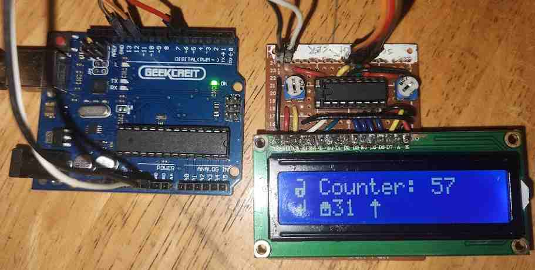

LCD1602 driven via a shift register to reduce the number of pins required for the Arduino UNO
- LCD1602
- Shift register: 74HC595

| Pin | Mode | Function |
| --- | --- | --- |
| 6 | output | latch |
| 11 | output | spi mosi (master out, slave in) |
| 13 | output | spi clock |

