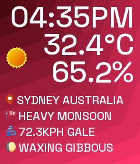

# Introduction
A small test harness to simulate the st7789 display and visualise it in the browser.



## Generate glyph files
1. Change to ```scripts``` folder: ```cd ./scripts```
2. Create virtual environment: ```python -m venv venv```
3. Activate virtual environmetn: ```source ./venv/scripts/activate```
4. Install python packages: ```pip install -r requirements.txt```
5. Generate font glyphs: ```./render_all_glyphs.sh```

## Testing application locally
### 1. Build application
1. Start shell with development environment containing C++ compiler
2. Configure cmake: ```cmake . -B build -G Ninja -DCMAKE_BUILD_TYPE=Debug -DCMAKE_EXPORT_COMPILE_COMMANDS=1```
3. Build program: ```cmake --build build```
### 2. Debug server without Arduino
1. Activate python environment
2. Start debug server: ```python ./debug_server.py process```
3. Open browser to visualiser: ```http://localhost:8080```
4. Press run to execute program and simulate the st7789's response after recompiling

## Running on the Arduino
### 1. Uploading application to Arduino
1. Connect the ST7789 display according to pinout specified in ```./tft.cpp``` in ```PIN``` to the Arduino
2. Connect the Arduino to your computer
3. Compile and upload the sketch to the Arduino
### 2. Debug server with Arduino
1. Activate python environment
2. Start debug server: ```python ./debug_server.py serial```
3. Open browser to visualiser: ```http://localhost:8080```
4. Press run to execute program and control the arduino through the web interface
### 3. Live server with Arduino
1. Activate python environment
2. Start live server: ```python ./live_server.py```
3. Inspect ST7789 connected to Arduino to see if it is receiving information from the live server
