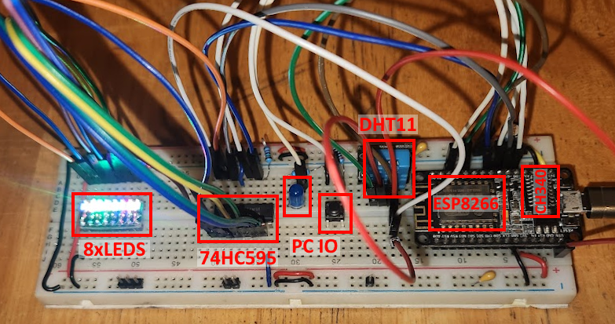

## Demo app using websockets
Basic ESP8266 sketch which:
- Serves a website
- Communicates over a websocket
- Uses freeRTOS through the esp8266-idf sdk

Refer to ```./scripts/README.md``` for setup instructions.



