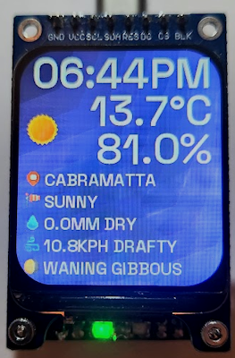
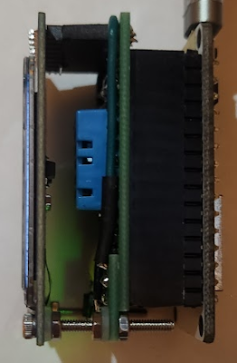
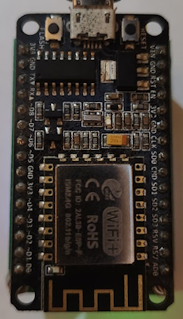
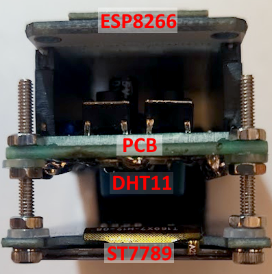
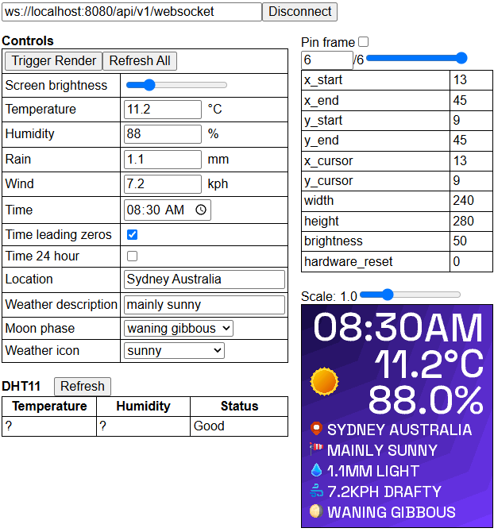

## Demo app using websockets
Basic ESP8266 sketch which:
- Connects to ST7789 display to render a weather widget
- Communicates over a websocket which can receive commands to update the weather widget with a python and javascript library
- Serves a website which can remotely update the weather widget for testing purposes
- Uses freeRTOS through the esp8266-idf sdk

Refer to ```./scripts/README.md``` for setup instructions.

   



## Wiring setup for ESP8266
### Pins used by project
| ESP8266 Pin | Description |
| --- | --- |
| GPIO15/D8 | ST7789 CS (chip select) |
| GPIO5/D1 | ST7789 RES (hardware reset) |
| GPIO12/D6 | ST7789 DC (data/command mode) |
| GPIO4/D2 | ST7789 BLK (backlight) |
| GPIO13/D7 | ST7789 SDA (spi mosi) |
| GPIO14/D5 | ST7789 SCL (spi clock) |
| GPIO2/D4 | DHT11 DATA (one wire interface) |
| GPIO0/D3 | Extra flash button (not useful yet) |
| GPIO9/SD2 | Extra green led (websocket clients connected) |

### Pins not used by project
| ESP8266 Pin | Description |
| --- | --- |
| GPIO10/SD4 | Gets random traffic even with DIO used instead of QIO [Arduino/issues/1446](https://github.com/esp8266/Arduino/issues/1446#issuecomment-172474688) |
| GPIO3/RX | Connected to RX in CH340 for the UART to USB bridge used for flashing and serial communication |
| GPIO1/TX | Connected to TX in CH340 for the UART to USB bridge used for flashing and serial communication |
| GPIO16/D0 | Used to wake the ESP8266 up from deep sleep |

### Additional notes
- For GPIO9/GPIO10 to be available the flash mode has to be set to DIO to free up those pins which is fine since QIO isn't supported properly anyways

## Pinout for peripherals
### DHT11
| Pin | Description |
| --- | --- |
| 1 | DATA (one wire interface) |
| 2 | VCC (3-5V) |
| 3 | GND (0V) |

### ST7789 module
| Pin | Description |
| --- | --- |
| 1 | GND (0V) |
| 2 | VCC (3.3-5V) |
| 3 | SCL (spi clock) |
| 4 | SDA (spi mosi) |
| 5 | RES (hardware reset) |
| 6 | DC (data/command mode) |
| 7 | CS (chip select) |
| 8 | BLK (backlight) |
