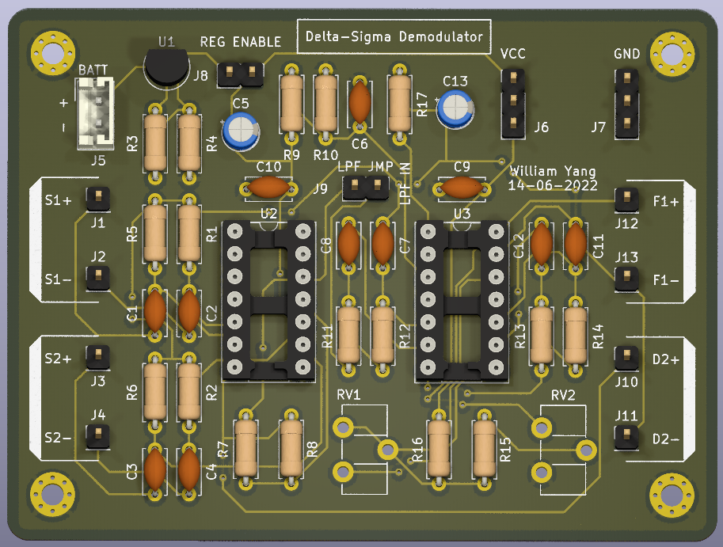

# Introduction
Demodulates digital delta sigma serial signal into original analog signal using:
- LM319 comparators to clean up digital delta sigma 1bit signal
- LM324 op amps to create a multi-stage active low pass filter

It is the receiver board for the delta sigma modulator transmitter board in ```kicad_delta_sigma_modulator```.

