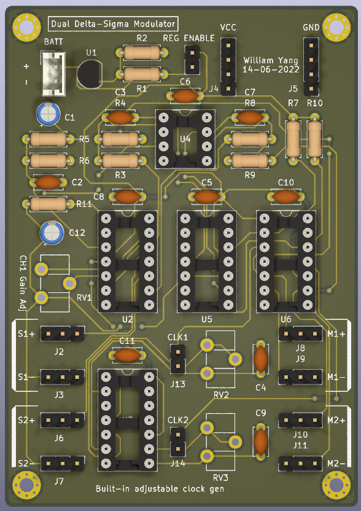

# Introduction
Modulates analog signal into serial delta sigma 1bit digital signal:
- LM556 to generate the clock signal for the 1bit delta sigma ADC
- 74HC74 D Flip-Flop to act as a 1bit ADC
- LM324 op amps to amplify and bias the signal to the correct voltage for the delta sigma modulator
- TL072 moderate bandwidth op amp for the delta sigma modulator's integrator
- LM319 comparator to turn triangular integral signal from TL072 into digital signal that will be latched by the 74HC74
- LM324 to generate a virtual ground to split the single positive supply rail in half
- LM317 to provided regulated voltage to the board from a 9V battery

It is the transmitter board for the delta sigma demodulator receiver board in ```kicad_delta_sigma_demodulator```.

