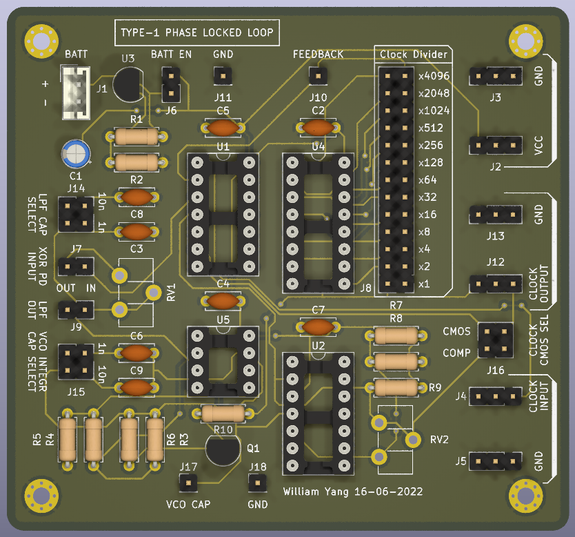

# Introduction
Type 1 Phased Locked Loop (PLL) that synchronises to an external clock signal by divisions of 2^N for N >= 0
- 74HC4040 counter to create clock feedback signals at ```f_out = f_in/2^N```
- 74HC86 XOR to create crude digital phase detector that creates an error signal between the phase of the input and output signals
- LM358 to create variable frequency triangular wave
- LM2901 comparator to turn the triangular wave into a square signal

