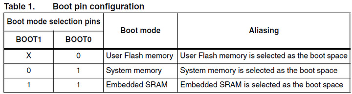

Hold Boot0 button (makes it high) to run from system memory instead of flash for programming

Two methods to program the flash
1. USB: Requires A9/A10 to be pulled to ground (5k resistor works)
2. USART: Doesn't require pull down resistors. A9 = TX, A10 = RX (Device side notation)

For USART to connect to FTDI UART chip
- A9 (TX) --> RX (FTDI)
- A10 (RX) --> TX (FTDI)
- FTDI chip should be placed into 3.3V mode using the jumper.

- NOTE: STM32F401 has BOOT1 on B2 which is pulled down by default 
- NOTE: Key button is just a button connected to A0

More info about the STM32F401 black pill development board can be found here:
- https://stm32-base.org/boards/STM32F411CEU6-WeAct-Black-Pill-V2.0.html 